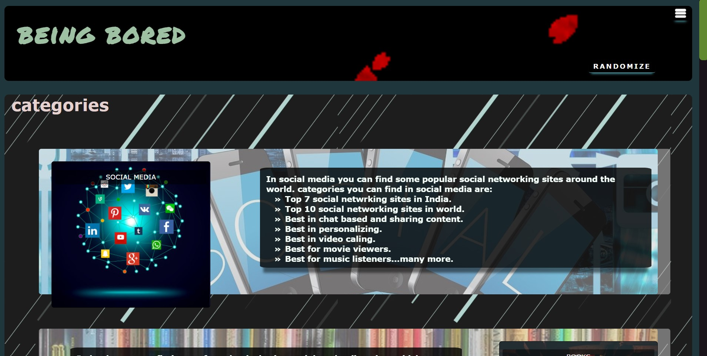
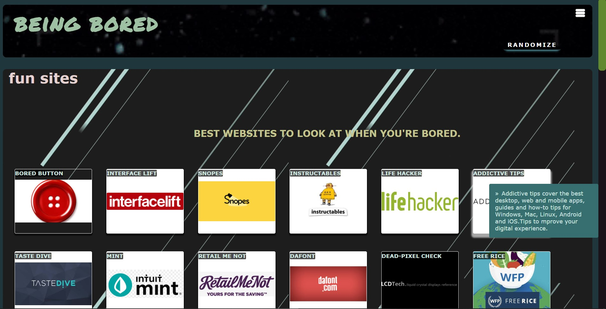
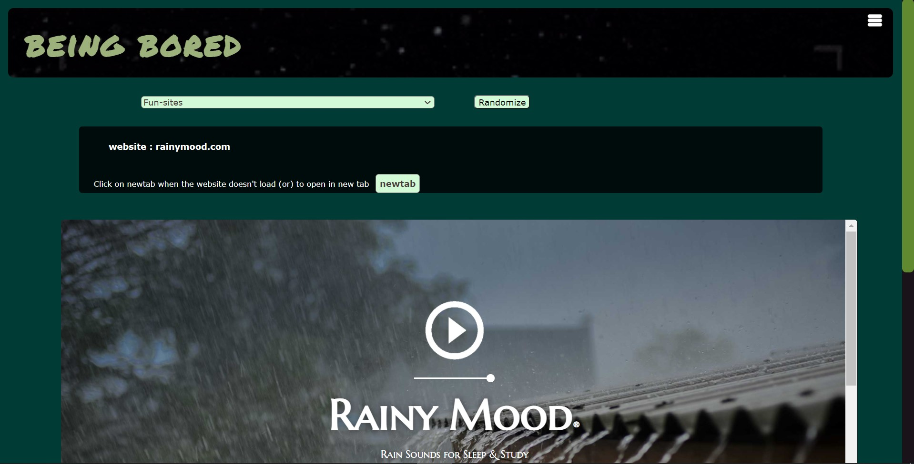

 <!-- This is a ReadMe template to help save you time and effort. -->

# Being Bored
Being Bored contains different categories where each
category contains various websites, and with Randomize
option, it shows the Random website of chosen category. [click here to visit the website](https://abdulmuheeth.github.io/beingbored.site/)

---

## Website is organized as

 

- The home page displays various categories, which will be helpful to get rid of boredom.
 

 

- Clicking on any one of the Categories will display the various website under that category. On click, they will redirect you to that website.

 

 

- Randomize Option on the Header will direct you to a page that will display a random from the selected Category.

 

---

[back to the top](#being-bored)
